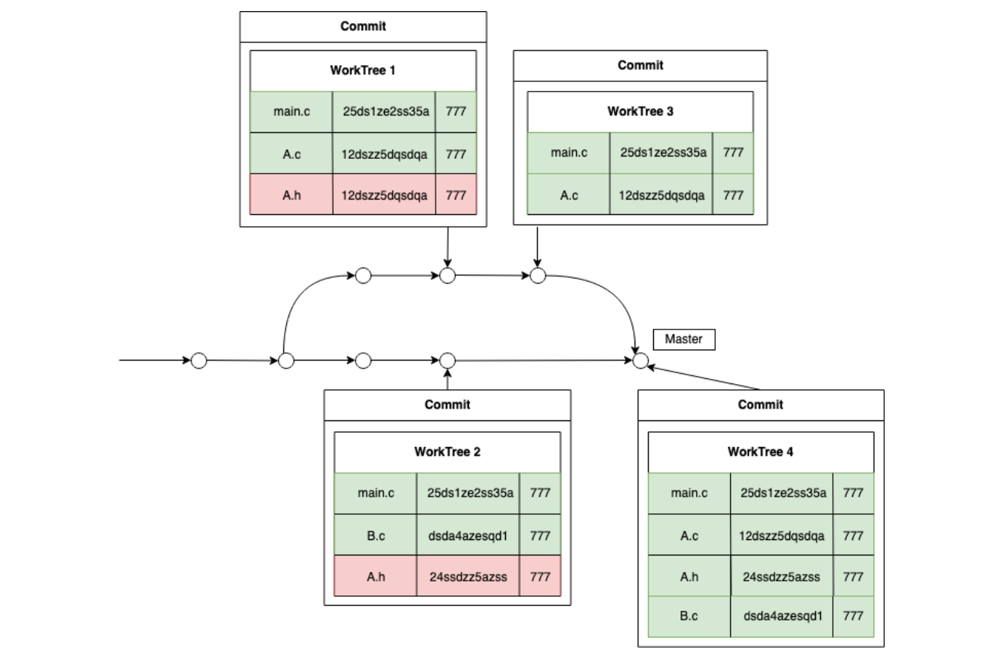

# Gestion des fusions de branches
`git merge` permet de fusionner 2 branches: créer un nouveau commit dont le `WorkTree` correspond à la fusion des `WorkTree` des derniers commits de ces branches

>**Note**: Ce nouveau commit est un peu spécial car il possède 2 prédécesseurs au lieu d'un seul

**Risque de conflits**: Un conflit survient lorsque les worktrees à fusionner contiennent un fichier/répertoire de même nom, mais avec des hash *(donc des contenus)* différents

$\to$ proposer des méthodes de gestion de conflits pour pouvoir fusionner des branches de manière pertinente.


## Première méthode de fusion 
>Commit de **suppression**

Pour résoudre un conflit: créer un commit dit *"de suppression"* qui consiste à **supprimer** les éléments conflictuels d'**une des 2 branches** avant de faire une fusion sans conflit. 

Example

Si l'utilisateur préfère conserver le fichier `A.h` de la branche `master` plutôt que celui de `Feature1`, alors on va créer un commit de suppression sur la branche `Feature1` qui consiste à supprimer `A.h` de cette branche.

$\to$ Possible de réaliser la fusion des 2 branches sans conflit

#### Note
- Après la fusion de `Feature1` et `master`, on doit supprimer `Feature1` car cette branche n'existe plus.
- Le commit de fusion doit bien avoir 2 prédécesseurs: 
	- clef `predecessor`, dont la valeur est le hash du dernier commit de branche courrante
	- clef `merged_predecessor`, correspondant au hash du dernier commit de la branche supprimée

## Fonction de base
```C
WorkTree* mergeWorkTree(WorkTree* wt1, WorkTree* wt2, List** conflicts);
```
Étant donnée 2 worktrees, crée: 
- une liste de chaines de caractères composée des noms de fichiers/répertoires qui sont en conflit
- un nouveau `WorkTree` des fichiers et/ou répertoires qui ne sont pas en conflit

```C
List* merge(char* remote_branch, char* message);
```
**Mission**: Fusionne la branche **courante** avec la branche **passée en paramètre** si **aucun conflit n'existe**.
- crée le worktree de fusion *(avec `mergeWorkTree`)*
- crée le commit associé à ce nouveau worktree: 
	- en indiquant qui sont des prédécesseurs
	- en lui ajoutant le message descriptif passé en paramètre
- réalise un enregistrement instantané du worktree de fusion + de ce nouveau commit
- ajouter le nouveau commit à la branche courante
- MAJ la référence de la branche courante et la référence `HEAD` pour pointer vers ce nouveau commit
- supprimer la référence de la branche passée en paramètre
- restaurer le projet correspondant au worktree de fusion

**Retour**: 
- Si au moins un conflit: 
	- aucune de ses opérations n'est effectuée
	- la fonction retourne la liste des conflits
- Sinon, retourne `NULL`

```C
void createDeletionCommit(char* branch, List* conflicts, char* message);
```
**Mission**: crée + ajoute un commit de suppression sur `branch`, correspondant à la suppression des éléments de la liste `conflicts`.
- se déplacer sur la branche en question *(à l'aide de `myGitCheckoutBranch`)*
- récupère le dernier commit de cette branche + le worktree associé
- vide la zone de préparation `.add` + utiliser `myGitAdd` pour ajouter les fichiers/répertoires du worktree qui ne font pas partie de la liste des conflits
- appelle `myGitCommit` pour créer le commit de suppression
- revient sur la branche de départ *(à l'aide de `myGitCheckoutBranch`)*