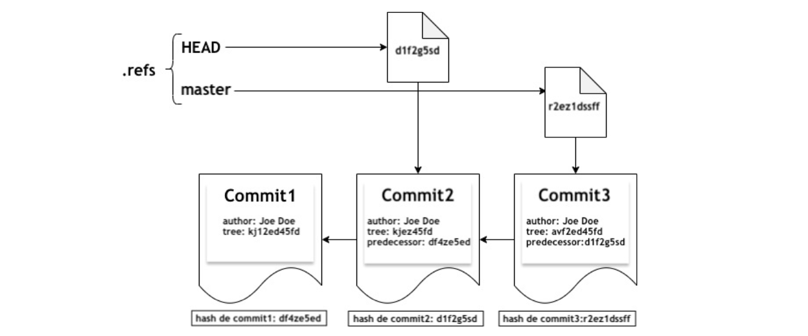

# GESTION DES COMMITS
## Préliminaire
Pour pouvoir suivre l'évolution d'un projet, il faut pouvoir organiser chronologiquement différents enregistrements instantanés. 

Pour cela, on utilise ce qu'on appelle des *commits*, qui sont des enregistrements instantanés associés à des étapes jugées importantes dans la chronologie du projet.
>**Commits** = point de sauvegarde

>*On souhaite garder une trace quand on s'intérresse à l'évolution du projet.*

Avec notre implémentation: 
- Un commit est associé à l'enregistrement instantané d'un `WorkTree`
- *[...]* accompagné d'autres informations relatives au point de sauvegarde

### Structure utilisée
```c
typedef struct key_value_pair {
  char* key;
  char* value;
} kvp;

typedef struct hash_table {
  kvp** T;
  int n; 
  int size;
} HashTable;

typedef HashTable Commit;
```
#### Note
- Un commit est implémenté par une table de hachage dont les clés et les valeurs sont des chaines de caractères
- Les éléments de la table doivent correspondre aux informations associées au point de sauvegarde
- Un `Commit` **devra au moins** contenir une paire de la forme `("tree",hash)` 
	
	où `hash` est le hash du fichier correspondant à l'enregistrement instantané d'un `WorkTree`

> **Remarque:** Cette partie a pour but de simuler les commandes `git add` et `git commit` de manière simplifiée

>**Remarque 2**: Dans cette partie, on travaille avec une seule branche, permettant de suivre l'**évolution d'un projet** de manière **linéaire**

## Fonction HASH choisie: `DJB2`
- [Homepage link](http://www.cse.yorku.ca/~oz/hash.html)
- [DJB2 Algo explained](https://thealgorithms.github.io/C/d4/de3/hash__djb2_8c.html#details)

- [Hash Functions for Strings](https://youtu.be/jtMwp0FqEcg)

## Fonctions de base
1. `kvp* createKeyVal(char* key,char* val)` : allouer + initialiser un élément
	
    `void freeKeyVal(kvp* kv)` : libérer la memoire associé à un élément
2. `char* kvts(kvp* k)`: convertir un élément en une chaine de caractères de la forme `cle:val`
	
    `kvp* stkv(char* str)`: permet de faire la conversion inverse
3. `Commit* initCommit()`: allouer et initialiser un `Commit` de taille fixée *(donnée par une constante du programme)*
4. `void commitSet(Commit* c,char* key,char* value)`: insère la paire `(key,value)` dans la table, en gérant les collisions par adressage ouvert et probing **linéaire**
5. `Commit* createCommit(char* hash)`: 
	- alloue et initialise un `Commit`
	- ajoute l'élément abligatoire correspondant à la clé `"tree"`
6. `char* CommitGet(Commit* c, char* key)`: 
	- cherche dans la table s'il existe un élément dont la clé est `key` *(en sachant qua les conflits sont résolus pas adressage ouvert et probing linéaire)*
	- retourne la valeur de l'élément s'il existe, `NULL` sinon
7. `char* cts(Commit* c)`: convertit un Commit en une chaine de carcatères *(composée des chaines de caractères représentant chacun de ses couples (clé, valeur), séparées par un saut de ligne)*
	
	`Commit* stc(char* file)`: réalise la conversion inverse
8. `void ctf(Commit* c, char* file)`: écrit dans le fichier `file` la chaine de caractères représentant le commit `c`.
	
	`Commit* ftc(char* file)`: charge un `Commit` depuis un fichier le représentant
9. `char* blobCommit(Commit* c)`: *comme `blobWorkTree` en remplacant `.t` par `.c`*

---
## Gestion *temporelle* des commits de manières linéaire
**Objectif**: permettre à l'utilisateur de créer des points de sauvegarde, qui seront organisés de manière linéaire, ordonnés par ordre chronologique, du plus récent au plus ancien. 

Chaque `Commit` doit posséder au minimum les clés suivantes: 
- `author`: l'identifiant de l'utilisateur qui a créé le point de sauvegarde
- `tree`: le hash du `WorkTree` correspondant au point de sauvegarde
- `message`: une description de ce point de sauvegarde
- `predecessor`: le hash du `Commit` correspondant au point de sauvegarde précédent


>Les commits sont organisés en liste simplement chainée: *il suffit de connaitre le **hash du dernier `Commit`** pour avoir accès à tous les autres à l'aide de la clé `predecessor`*
>
>*(une telle sera appelée **branche** dans la suite)*

Pour avoir accès à cette branche et la manipuler facilement, on utilise des références.
> `git`: Références = pointeurs vers des commits.

Ils se présentent sous la forme de **fichiers contenant le hash du `Commit` concerné**. Ces fichiers sont stockés dans un répertoire caché `.refs`.

Dans `.refs`, il faut au moins 2 références: 
- `master`: 
	- fichier contenant le hash du dernier `Commit` *(plus récent)*
	- une fois ce nom choisi, il donnera son nom à la branche
- `HEAD`: 
	- fichier contenant le hash d'un commit quelconque
	- utilisé pour simuler des déplacements dans la timeline
	- Par défaut: contient le hash du dernier `Commit` de la branche



### MANIPULATION DES RÉFÉRENCES
1. `void initRefs()`: crée le répertoire caché `.refs` *(s'il n'existe pas déjà)* + crée `master` et `HEAD`
2. `void createUpdateRef(char* ref_name, char* hash)`: 
	- met à jour une référence en remplacent son contenu par `hash`
	- Si la référence n'existe pas: la fonction commence par créer le fichier
3. `void deleteRef(char* ref_name)`: supprime une référence
4. `char* getRef(char* ref_name)`: 
	- récupère vers quoi pointe une référence *(le hash contenu dans le fichier)*
	- Si le fichier est vide, retourne une chaine de caractère vide
	- Si le fichier n'existe pas, retourne `NULL`

### SIMULATION DE `GIT ADD`
```C
void myGitAdd(char* file_or_folder);
```
#### Mission 
- ajouter un fichier ou répertoire dans le `WorkTree` correspondant à la zone de préparation
- Si `.add` n'existe pas, il faut d'abord le créer
- Requis: `appendWorkTree`

#### Process
**Note**: Avant de réaliser un commit, indiquez au programme quels sont les fichiers et/ou répertoires pour lesquels on souhaite créer un point de sauvegarde.

Ce sont des fichiers/répertoires qui ont été modifiés *depuis le dernier point de sauvegarde*, et dont la version courante est suffisamment satisfaisante pour vouloir les sauvegarder. 

>`git add`: place ces fichiers/répertoires dans une zone appelée *zone de préparation - staging area*

Dans ce projet: simuler la zone de préparation à l'aide d'un fichier caché `.add`: 
- ce fichier = la représentation d'un `WorkTree`, initialement vide
- dans lequel l'utilisateur ajoutera progressivement les fichiers et/ou répertoire qui doivent faire partir du prochain commit

### SIMULATION DE LA COMMANDE `GIT COMMIT`
```C
void myGitCommit(char* branch_name, char* message);
```
#### Process
- Si `.refs` n'existe pas: affiche le message *"Initialiser d'abord les références du projet"* + se termine
- Si `branch_name` n'existe pas: affiche *"La branche n'existe pas"* + se termine
- Si `HEAD != branch_name`: affiche *"`HEAD` doit pointer sur le dernier commit de la branche"* + se termine
- Sinon: 
	- charger le `WorkTree` correspondant à `.add` + supprimer `.add`
	- enregistrer ce `WorkTree` avec `saveWorkTree` + récupère son hash
	- Créer un `Commit c` contenant `("tree",hash)` avec le `hash` du `WorkTree`
	- Lire `branch_name` + récupérer le hash du dernier commit de la branche + ajouter ce hash comme `predecessor` de `c`
		- Si `branch_name` vide: ne crée pas de `predecessor` pour ce commit
	- Si `message!=NULL`: ajouter le au commit de `c` comme message descriptif
	- `blobCommit` + récupérer son hash
	- MAJ `branch_name` en remplacant son contenu avec le hash de `c`
	- MAJ `HEAD` *(comme `branch_name`)*
