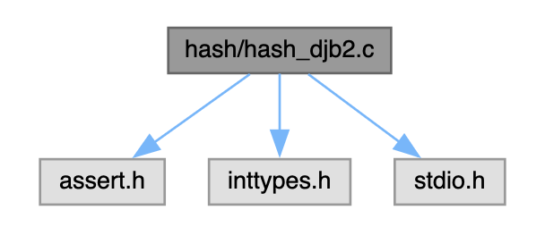

# GESTION DES COMMITS
## Preliminaire
Pour pouvoir suivre l'evolution d'un projet, il faut pouvoir organiser chronologiquement differents enregistrements instantanes. 

Pour cela, on utilise ce qu'on appelle des *commits*, qui sont des enregistrements instantanes associes a des etapes jugees importantes dans la chronologie du projet.
>**Commits** = point de sauvegarde

>*On souhaite garder une trace quand on s'interresse a l'evolution du projet.*

Avec notre implementation: 
- Un commit est associe a l'enregistrement instantane d'un `WorkTree`
- *[...]* accompagne d'autres informations relatives au point de sauvegarde

### Structure utilisee
```c
typedef struct key_value_pair {
  char* key;
  char* value;
} kvp;

typedef struct hash_table {
  kvp** T;
  int n; 
  int size;
} HashTable;

typedef HashTable Commit;
```
#### Note
- Un commit est implemente par une table de hachage dont les cles et les valeurs sont des chaines de caracteres
- Les elements de la table doivent correspondre ayx informations associees au point de sauvegarde
- Un `Commit` **devra au moins** contenir une paire de la forme `("tree",hash)` 

  où `hash` est le hash du fichier correspondant a l'enregistrement instantane d'un `WorkTree`
> **Remarque:** Cette partie a pour but de simuler les commandes `git add` et `git commit` de maniere simplifiee

## Fonction HASH choisie: `DJB2`
- [Homepage link](http://www.cse.yorku.ca/~oz/hash.html)
- [DJB2 Algo explained](https://thealgorithms.github.io/C/d4/de3/hash__djb2_8c.html#details)

- [Hash Functions for Strings](https://youtu.be/jtMwp0FqEcg)

## Fonctions de base
1. `kvp* createKeyVal(char* key,char* val);` : allouer + initialiser un element

    `void freeKeyVal(kvp* kv);` : liberer la memoire associe a un element
2. `char* kvts(kvp* k)`: Convertir un element en une chaine de caracteres de la forme `cle:val`

    `kvp* stkv(char* str);`: permet de faire la conversion inverse
3. `Commit* initCommit();`: allouer et initialiser un `Commit` de taille fixee *(donnee par une constante du programme)*
4. `void commitSet(Commit* c,char* key,char* value);`: insere la paire `(key,value)` dans la table, en gerant les collisions par adressage ouvert et probing **lineaire**