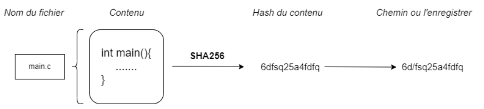

# VERS LA CRÉATION D'ENREGISTREMENTS INSTANTANÉS
**Pt1:** Enregistrement d'un instantanée d'**un** fichier

Sous `git`, tous les objets, *qu'ils soient relatifs aux fichiers versionnés ou à leurs méta-données*, sont enregistrés sous forme de fichiers. <br>
Ces fichiers ont pour particularité de pouvoir dériver le chemin où ils sont stockés à partir de leur contenu. 


#### Note
- Ici, la fonction de hachage `SHA256` est appliquée sur le contenu du fichier
- Le chemin où doit être stocké le fichier est obtenu en insérant `/` entre le 2è et 3è caractères du hash. 

Faire dépendre le chemin du contenu permet notamment de sauvegarder toutes les différentes versions du fichier. 


#### **Modifier le contenu du fichier** va: 
- modifier le chemin vers lequel le sauvegarder 
- créer différentes sauvegardes correspondant à différentes états du fichier. 

*(Quand on réalise une telle **sauvegarde**, on dit communément qu'on "enregistre **un instantané**"/qu'on créer un "enregistrement instantané".)*
***
## Prise en main de Bash
Les données sur le disque sont stockées dans des fichiers, dont des structures de données qui apparaissent aux programmes comme des **suites finies d'octets**. 
> **File system**: 
>- La structure de données qui organise les fichiers sur le disque
>- Une des fonctionnalités principales d'un système d'exploitation

>Bash permet d'utiliser une interface en ligne de commande.
### Liste de commandes basiques en Bash
- `man`: afficher la documentation de la commande concernée
- `pwd`: afficher le répertoire courant
- `cd`: se positionner sur un certain répertoire de travail
- `mkdir`: créer un répertoire
- `touch` *`nom_de_fichier`*: créer le fichier de nom *`nom_de_fichier`*
- `ls`: lister les fichiers d'un répertoire
- `cat`: affichier le contenu d'un fichier
- `rm`: supprimer un fichier

#### Other:
- possible de rediriger une des sorties vers un fichier. 
	
	`ls > list.txt`: obtenir `list.txt` contenant la liste des fichiers et répertoires présents dans le répertoire courant *(plutôt créer `list.txt`)*
- possible de rediriger la sortie d'une commande vers une autre, en utilisant **pipeline**.
	
	`cat noms.txt | sort`: lire la liste de noms présente dans le fichier `noms.txt` + la transmettre a la fonction `sort` qui va la trier *(ordre alphabétique)*

Linux met en place des flux globaux permettant a des commandes appelées, de dialoguer avec le programme appelant en écrivant ou en lisant depuis ces flux.

```shell
ls > file.tmp
cat file.tmp
cat main.c | sha256sum > file.tmp
cat file.tmp
```

### Les flux globaux:
- `stdin` *(entrée standard)*: 
	- flux d'entrée du programme
	- défaut: des données saisies au clavier
	- permet de définir des programmes interactifs, récupérant des données saisies sur le terminal par l'utilisateur *(par le biais de `scanf` etc.)*
- `stdout` *(sortie standard)*: 
	- la sortie du programme
	- défaut: du terminal ayant lancé le programme
	- permet d'afficher des données sur le terminal
- `stderr` *(sortie standard d'erreur)*: 
	- sert a récupérer les messages d'erreurs
	- par défaut les afficher sur le terminal ayant lancé le programme

### New stuff on C for me
- **Commande `sha256sum`:** hacher le contenu d'un fichier en utilisant la fonction de hachage `SHA256`.
- **Fonction `system`:** 
	- permet de faire des appels système. 
	- pas le seul moyen de manipuler le file system
	- 2 codes équivalentes: 
  ```C
  #include <stdio.h>
  #include <stdlib.h>
  int main(void) {
    FILE *f = fopen("test.txt","w");
    fprintf(f, "Test");
  }
  ```
  ```C
  #include <stdio.h>
  #include <stdlib.h>
  int main(void) {
    system("echo Test > text.txt");
  }
  ```
    - `>`: write `Test` into `text.txt`
#### Librairie `<unistd>`
- permet une **gestion efficace des fichiers temporaires**
- utile pour stocker le hash d'un fichier en attente de lecture par le programme
- Fonction `mkstemp(fname)`: crée un fichier temporaire dont le nom stocké dans `fname`
  ```C
  static char template[] = "/tmp/myfileXXXXXX";
  char fname[1000];
  strcpy(fname, template);
  int fd = mktemps(fname);
  ```
  - faut que les 6 derniers caractères de `template` soit `"XXXXXX"` pour que `mkstemps` les remplacent pour créer un nom de fichier unique.
  - `mkstemp` ouvre, *ensuite*, le fichier temporaire nouvellement crée + renvoie un descripteur de fichier ouvert *(lecture + écriture)*

#### Librairie `<dirent.h>`
- Fonctions `opendir` et `readdir`: permettent d'explorer un répertoire
```C
DIR* dp = opendir(root_dir);
struct dirent *ep;
if (dp!=NULL) {
  while ((ep=readdir(dp))!=NULL) printf("\%s \n",ep->d_name);
}
```
# Source code pack
## Global usage
1. Fonction `int hashFile(char* source, char* dest)`: étant donné le chemin de 2 fichiers
    - calcule le hash du contenu du premier fichier
    - l'écrit dans le deuxième fichier

2. Fonction `char* sha256file(char* file)`: 
    - Requirement: 
	    - la commande `sha256sum`
	    - 1 pipe
	    - 1 redirection
	    - 1 fichier temporaire *(supprimé après l'usage!)*
    - renvoie 1 chaine de caractères contenant *le hash du fichier donné en paramètre*

## Implementation d'une **liste de chaines de caracteres**
```C
typedef struct cell {
  char* data;
  struct cell* next;
} Cell;
typedef Cell* List;
```
### Manipulating function
1. `List* initList()`: initialise une liste vide 
	
	*(ne plus initialiser de liste autrement que par cette fonction)*
1. `Cell* buildCell(char* ch)`: allouer + retourner une cellule de la liste
2. `void insertFirst(List* L, Cell* C)`: ajouter un élément en tête d'une liste
3. `char* ctos(Cell* c)`: retourne le chaine de caractères qu'elle représente 
	
	`char* ltos(List* L)`: transforme une liste en une chaine de caractere de format: `chain1|chaine2|...` *(utilisant fonction `ctos`)*
1. `Cell* listGet(List* Lm int i)`: renvoie le i-ième élément d'une liste
2. `Cell* searchList(List* L, char* str)`
    - recherche un élément dans une liste à partir de son contenu
    - renvoie une référence vers lui / `NULL` si absent de la liste
3. `List stol(char* s)`: transformer une chaine de caractères représentant une liste en une liste chainée
4. `void ltof(List* L, char* path)`: écrire une liste dans un fichier 
	
	`List* ftol(chr* path)`: lire une liste enregistrée dans un fichier
## Gestion de fichier sous `git`
**Objectif:** produire une fonction qui enregistre un instantané *(réalise une sauvegarde)* d'un fichier dont le nom est donné en paramètre.
1. `List* listdir(char* root_dir)`: 
    - prend en paramètre une adresse
    - renvoie une liste contenant les noms des fichiers et répertoires qui s'y trouvent
2. `int file_exists(char* file)`: renvoie `1` si le fichier existe dans le répertoire **courant** et `0` sinon
3. `void cp(char* to, char* from)`: copie le contenu d'un fichier vers un autre *(en **lisant ligne par ligne** du fichier source)*
	
	**Note:** vérifier que le fichier source existe avant !
1. `char* hashToPath(char* hash)`: retourne le chemin d'un fichier à partir de son hash
2. `void blobFile(char* file)`: enregistre un instantané *(réalise un sauvegarde)* du fichier donnée en entrée 
	
	**Note:** en utilisant `mkdir`
